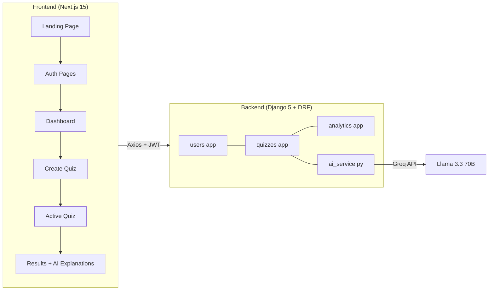

# AuraQuiz — AI Powered Quiz Platform

AuraQuiz is a full-stack AI-powered quiz platform where users can generate quizzes on any topic, take them interactively, and track their performance through analytics.

The application is built using **Next.js for the frontend**, **Django REST Framework for the backend**, and **PostgreSQL for the database**. AI is used to dynamically generate quiz questions.

---

# Tech Stack

| Layer | Technology |
|------|-------------|
| Frontend | Next.js 15, React |
| Backend | Django 5, Django REST Framework |
| Authentication | JWT (SimpleJWT) |
| Database | PostgreSQL (production), SQLite (development) |
| AI | Groq API – Llama 3.3 |
| Deployment | Render (backend), Vercel (frontend) |

---

# System Architecture

---

# Core Features

### User Authentication

- User registration
- Secure login
- JWT-based authentication
- Session persistence

---

### AI Quiz Generation

Users can create quizzes by specifying:

- Topic
- Difficulty level
- Number of questions (5-20)

The backend sends a prompt to the AI model which generates multiple-choice questions.

---

### Quiz Attempt

Users take quizzes interactively:

- One question at a time
- Progress tracking
- Option selection
- Quiz navigation

---

### Results and Review

After completing a quiz, users can:

- View their score
- Review answers
- See AI-generated explanations

---

### Analytics Dashboard

The system tracks:

- Total quizzes attempted
- Accuracy percentage
- Topic-wise performance
- Recent quiz attempts

---

# Database Design

The system uses relational models designed for tracking quizzes and attempts.

Main entities:

| Model | Purpose |
|------|--------|
User | Stores user accounts |
Quiz | Stores quiz metadata |
Question | Stores quiz questions |
QuizAttempt | Tracks each attempt |
UserAnswer | Stores selected answers |

Relationships:

- A **User** can create multiple quizzes
- A **Quiz** contains multiple questions
- A **User** can attempt multiple quizzes
- Each **QuizAttempt** stores user answers

---

# API Structure

### Authentication
POST /api/users/register/

POST /api/users/login/

POST /api/users/token/refresh/

GET /api/users/me/

### Quiz

POST /api/quizzes/

GET /api/quizzes/

GET /api/quizzes/:id/

### Analytics

POST /api/analytics/submit/

GET /api/analytics/performance/

GET /api/analytics/attempts/:id/

---

# Installation

## Clone Repository

git clone https://github.com/HariniSreeJ/ai-quiz-platform.git

cd ai-quiz-platform

---

# Backend Setup

cd backend

python -m venv venv

venv\Scripts\activate

pip install -r requirements.txt

Create `.env` file:

GROQ_API_KEY=your_api_key

Run migrations:

python manage.py migrate

Start server:

python manage.py runserver

---

# Frontend Setup

cd frontend
npm install

Create `.env.local`:

NEXT_PUBLIC_API_URL=http://localhost:8000/api

Start frontend:

npm run dev

---

## Live Deployment

The application is deployed and accessible through the following links:

| Service | URL |
|--------|------|
| Frontend (Vercel) | https://ai-quiz-platform-ecru.vercel.app/ |
| Backend API (Render) | https://ai-quiz-platform-3cwj.onrender.com/ |

Environment variables are configured on the hosting platforms.

---

# Challenges Faced

### AI Output Formatting

AI responses sometimes included markdown formatting or invalid JSON.

**Solution**

Implemented preprocessing to clean responses and ensure valid JSON parsing.

---

### Token Expiration

JWT tokens expire which could interrupt user sessions.

**Solution**

Implemented automatic token refresh using Axios interceptors.

---

### Preventing Client-Side Manipulation

Calculating scores on the client could allow cheating.

**Solution**

All grading logic is implemented on the backend.

---

# Features Implemented

- User authentication
- AI quiz generation
- Interactive quiz interface
- Result review with explanations
- Analytics dashboard
- Quiz history

---

# Future Improvements

- AI-based study recommendations
- Leaderboards
- Microservices based architecture
- Async AI generation with Celery
- Redis caching

---

# Author

Harini Sree J  
GitHub: https://github.com/HariniSreeJ
